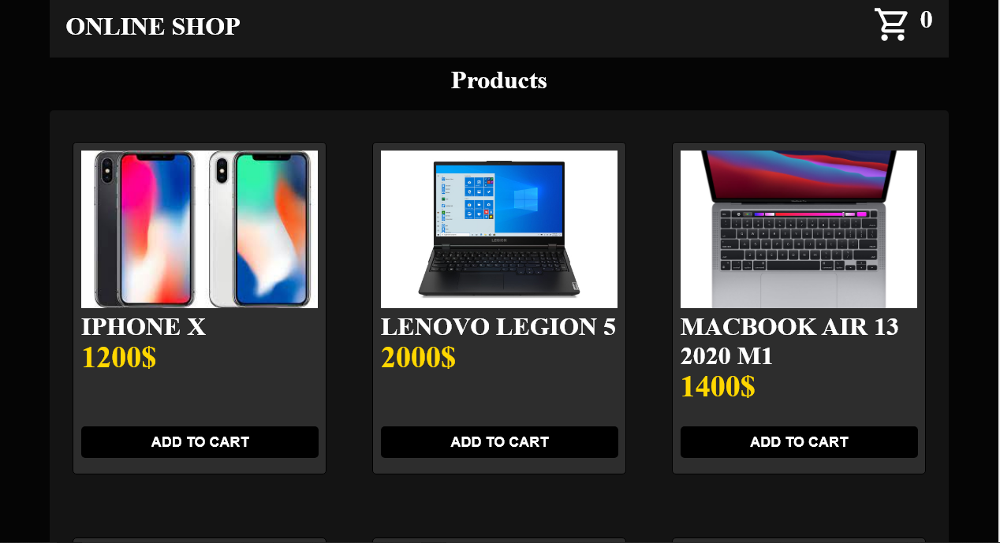

# Shop

[demo]([https://andriydubovichwork.github.io/learning-languages-ts/](https://andriydubovichwork.github.io/shop))

### This is react based uncomercial shop the products are from local files also there is cart and coupones you can add to cart or remove from it also you can increase the quantity of product when you click on buy button in cart you will open paypal payment and you will pay 1/100 of price i made it so if you mistake made payment it will be smaller money.also i aded google maps location choose you can see it if you press the button choose location.also there is cart icon at the header of site you can see the count of different ptoducts in cart.And there is coupone that will give you 50% off "kaktus"

